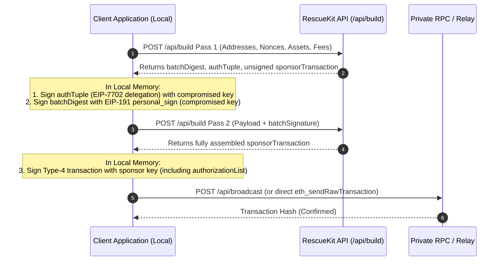

# Headless REST API Reference

> Machine-to-machine HTTP specification for assembling, signing, and broadcasting EIP-7702 atomic asset recovery batches.

The RescueKit REST API allows automated scripts, security bots, whitehat rescue operations, and third-party custody providers to construct and broadcast asset rescue batches without running a web browser.

---

## 1. Global API Architecture & Rate Limiting

### Base URL & Supported Protocols
All API requests are sent over HTTPS using standard JSON payloads:
```text
https://rescuekit.vercel.app/api
```

### Privacy & Anonymous Rate Limiting
To protect user privacy and defend the infrastructure against DoS attacks, RescueKit employs an in-memory sliding window rate limiter (`_rateLimit.ts`):
- **Zero Raw IP Storage**: Client IP addresses are never logged or stored in plaintext. They are scrambled instantly using a one-way SHA-256 hash:
  ```typescript
  clientToken = createHash("sha256").update(rawIp).digest("hex").slice(0, 16);
  ```
- **Edge Header Resolution**: Client IP is extracted according to strict proxy trust priority:
  1. `x-vercel-forwarded-for` (Vercel edge router)
  2. `x-real-ip` (reverse proxy)
  3. `x-forwarded-for` (standard multi-hop)
  4. Remote socket address fallback
- **Sliding Window Window**: 60 seconds.

### Rate Limits & Standard RFC Headers
Every response includes standard rate-limit tracking headers:

| Header | Description |
| :--- | :--- |
| `X-RateLimit-Limit` | Maximum allowed requests per 60-second window. |
| `X-RateLimit-Remaining` | Remaining requests allowed within the active window. |
| `X-RateLimit-Reset` | Unix timestamp (in seconds) when the quota resets. |
| `Retry-After` | Included on HTTP 429; integer seconds until retry is permitted. |

#### Endpoint Quotas:
- `POST /api/build`: **10 requests / minute**
- `POST /api/broadcast`: **5 requests / minute**
- `POST /api/execute`: **5 requests / minute**

When a limit is exceeded, the server responds with `HTTP 429 Too Many Requests`:
```json
{
  "success": false,
  "error": "Too many requests. Please try again in 42 seconds."
}
```

---

## 2. Endpoints

### 1. `POST /api/build`
Assembles an ERC-7821 rescue batch, computes execution calldata, calculates gas requirements, and derives the exact cryptographic digest for client signing. **This endpoint is completely read-only and requires zero private keys.**

#### Request Headers:
```http
Content-Type: application/json
```

#### Request Body Parameters:

| Field | Type | Required | Description |
| :--- | :--- | :--- | :--- |
| `chain` | string | **Yes** | Target network slug (`ethereum`, `base`, `optimism`, `bsc`, `polygon`, `monad`). |
| `compromisedAddress` | string | **Yes** | 42-character EVM address (`0x...`) of the compromised account. |
| `safeDestination` | string | **Yes** | 42-character EVM address (`0x...`) of the uncompromised recovery wallet. |
| `sponsorAddress` | string | **Yes** | 42-character EVM address (`0x...`) of the gas-paying sponsor wallet. |
| `compromisedNonce` | number | **Yes** | Current on-chain transaction nonce of the compromised account. |
| `sponsorNonce` | number | **Yes** | Current on-chain transaction nonce of the sponsor wallet. |
| `maxFeePerGas` | string | **Yes** | Max fee per gas in wei (e.g. `"2000000000"` for 2 gwei). |
| `maxPriorityFeePerGas` | string | **Yes** | Priority tip in wei (e.g. `"100000000"` for 0.1 gwei). |
| `mode` | string | No | Batch type: `transfer` (default), `mint-and-transfer`, `mint-only`, `claim`, `lending`. |
| `tokens` | array | No | For `transfer` mode: list of token addresses or `"native"` (e.g. `["native", "0x8335..."]`). |
| `nftCollection` | string | No | For `mint` mode: target NFT contract address. |
| `mintStandard` | string | No | For `mint` mode: `721` (Mode 7), `1155` (Mode 8), or `mint-only` (Mode 6). |
| `mintCalldata` | string | No | For `mint` mode: ABI-encoded mint interaction data. |
| `mintValue` | string | No | For `mint` mode: native ETH value required for mint fee (in wei). |
| `claims` | array | No | For `claim`/`multi-claim`: array of `{ contract, calldata, value, sweepTokens }`. |
| `positions` | array | No | For `lending` mode: array of lending positions to unwind and sweep. |
| `referrer` | string | No | Optional EVM address of affiliate referrer for 6% commission. |
| `batchSignature` | string | No | Optional pre-signed EIP-191 signature. If supplied, pre-encodes complete `execute` payload. |

#### Sample Request (`/api/build` for Token Transfer):
```json
{
  "chain": "base",
  "compromisedAddress": "0x71C7656EC7ab88b098defB751B7401B5f6d8976F",
  "safeDestination": "0x9876543210987654321098765432109876543210",
  "sponsorAddress": "0x1234567890123456789012345678901234567890",
  "compromisedNonce": 0,
  "sponsorNonce": 1,
  "maxFeePerGas": "2000000000",
  "maxPriorityFeePerGas": "100000000",
  "mode": "transfer",
  "tokens": [
    "0x833589fCD6eDb6E08f4c7C32D4f71b54bdA02913"
  ]
}
```

#### Success Response (`HTTP 200 OK`):
```json
{
  "success": true,
  "mode": "transfer",
  "chain": "base",
  "chainId": 8453,
  "compromisedAddress": "0x71C7656EC7ab88b098defB751B7401B5f6d8976F",
  "safeDestination": "0x9876543210987654321098765432109876543210",
  "sponsorAddress": "0x1234567890123456789012345678901234567890",
  "referrer": null,
  "authTuple": {
    "contractAddress": "0x43155E33e053054a06F24FDa60F27F2741678301",
    "chainId": 8453,
    "nonce": 0
  },
  "batchDigest": "0x186e7d6047917b4ee234a51c7ae1d715955b8387fb857f506c6941675b85498e",
  "sponsorTransaction": {
    "type": "eip7702",
    "to": "0x71C7656EC7ab88b098defB751B7401B5f6d8976F",
    "data": "0xe9ae5c53...",
    "value": "0",
    "chainId": 8453,
    "nonce": 1,
    "gas": "350000",
    "maxFeePerGas": "2000000000",
    "maxPriorityFeePerGas": "100000000"
  },
  "summary": {
    "callsCount": 1,
    "gasLimit": "350000",
    "maxGasCostNative": "0.0007",
    "totalMaxCostNative": "0.0007",
    "nativeGasToken": "ETH",
    "maxFeePerGasGwei": "2.000",
    "maxPriorityFeePerGasGwei": "0.100"
  }
}
```

---

### 2. `POST /api/broadcast`
Broadcasts a fully assembled, pre-signed raw Type-4 transaction directly to a high-speed private RPC endpoint (e.g. MEV Blocker, Flashbots, or custom client RPC).

#### Request Body Parameters:

| Field | Type | Required | Description |
| :--- | :--- | :--- | :--- |
| `chain` | string | **Yes** | Target network slug (`ethereum`, `base`, `optimism`, `bsc`, `polygon`, `monad`). |
| `signedTransaction` | string | **Yes** | Hex string (`0x...`) of the serialized signed Type-4 transaction. |
| `rpcUrl` | string | **Yes** | Client-provided RPC endpoint (e.g. Alchemy, Infura, QuickNode, MEV Blocker). |

#### Sample Request:
```json
{
  "chain": "base",
  "signedTransaction": "0x04f8...",
  "rpcUrl": "https://mainnet.base.org"
}
```

#### Success Response (`HTTP 200 OK`):
```json
{
  "success": true,
  "chain": "base",
  "chainId": 8453,
  "txHash": "0x4a7e...",
  "explorerUrl": "https://basescan.org/tx/0x4a7e..."
}
```

---

### 3. `POST /api/execute`
Headless 1-shot execution endpoint. Accepts private keys, builds the batch, signs both authorization and transaction payloads in server memory, and broadcasts immediately.
> **Security Notice**: Intended exclusively for automated CLI daemons and local development. For zero-trust production deployments, use the two-pass client signing flow detailed below.

#### Request Body Parameters:
- `chain`: Target network slug (`base`, `ethereum`, `monad`, `polygon`, `bsc`, `optimism`).
- `compromisedPrivateKey`: 32-byte hex private key (`0x...`) of the compromised account.
- `sponsorPrivateKey`: 32-byte hex private key (`0x...`) of the clean sponsor wallet with gas.
- `safeDestination`: Uncompromised recovery address (`0x...`).
- `compromisedNonce`: Current on-chain nonce of the compromised account.
- `sponsorNonce`: Current on-chain nonce of the sponsor wallet.
- `maxFeePerGas`: Maximum gas fee in wei (e.g. `"2000000000"` for 2 gwei).
- `maxPriorityFeePerGas`: Priority tip in wei (e.g. `"100000000"` for 0.1 gwei).
- `mode`: Batch mode (`transfer`, `mint-and-transfer`, `mint-only`, `claim`, `lending`).
- `tokens`: List of token contract addresses or `"native"` to sweep (for `transfer` mode).
- `rpcUrl`: Optional custom RPC endpoint URL to simulate and broadcast the transaction.
- `referrer`: Optional affiliate address for 6% commission.

---

## 3. Zero-Key Two-Pass Client Signing Tutorial

The most secure way to integrate RescueKit into bots or infrastructure is the **Two-Pass Offline Flow**. Your private keys never touch the network:



### TypeScript / Viem Implementation Example

```typescript
import { createPublicClient, http, type Hex } from "viem";
import { privateKeyToAccount } from "viem/accounts";
import { base } from "viem/chains";

async function runZeroKeyRescue() {
  const compromisedKey = "0x..." as Hex;
  const sponsorKey = "0x..." as Hex;
  const safeDest = "0x9876543210987654321098765432109876543210";

  const compromisedAccount = privateKeyToAccount(compromisedKey);
  const sponsorAccount = privateKeyToAccount(sponsorKey);

  // 1. Request batch build from API (Pass 1 - no keys shared)
  const buildPayload1 = {
    chain: "base",
    compromisedAddress: compromisedAccount.address,
    safeDestination: safeDest,
    sponsorAddress: sponsorAccount.address,
    compromisedNonce: 0,
    sponsorNonce: 5,
    maxFeePerGas: "2000000000",
    maxPriorityFeePerGas: "100000000",
    mode: "transfer",
    tokens: ["native", "0x833589fCD6eDb6E08f4c7C32D4f71b54bdA02913"],
  };

  const buildRes1 = await fetch("https://rescuekit.vercel.app/api/build", {
    method: "POST",
    headers: { "Content-Type": "application/json" },
    body: JSON.stringify(buildPayload1),
  });
  const buildData1 = await buildRes1.json();
  if (!buildData1.success) throw new Error(buildData1.error);

  // 2. Sign EIP-7702 authorization tuple locally with compromised key
  const authorization = await compromisedAccount.signAuthorization({
    contractAddress: buildData1.authTuple.contractAddress,
    chainId: buildData1.authTuple.chainId,
    nonce: buildData1.authTuple.nonce,
  });

  // 3. Sign the batch digest locally with EIP-191 personal_sign
  const batchSig = await compromisedAccount.signMessage({
    message: { raw: buildData1.batchDigest },
  });

  // 4. Request final assembled transaction (Pass 2 with batchSignature)
  const buildRes2 = await fetch("https://rescuekit.vercel.app/api/build", {
    method: "POST",
    headers: { "Content-Type": "application/json" },
    body: JSON.stringify({
      ...buildPayload1,
      batchSignature: batchSig,
    }),
  });
  const buildData2 = await buildRes2.json();
  if (!buildData2.success) throw new Error(buildData2.error);

  const txData = buildData2.sponsorTransaction;

  // 5. Sign Type-4 (EIP-7702) transaction with sponsor wallet
  const rawTx = await sponsorAccount.signTransaction({
    type: "eip7702",
    to: txData.to,
    data: txData.data,
    value: BigInt(txData.value || 0),
    chainId: txData.chainId,
    nonce: txData.nonce,
    gas: BigInt(txData.gas),
    maxFeePerGas: BigInt(txData.maxFeePerGas),
    maxPriorityFeePerGas: BigInt(txData.maxPriorityFeePerGas),
    authorizationList: [authorization],
  });

  // 6. Broadcast via /api/broadcast
  const broadcastRes = await fetch("https://rescuekit.vercel.app/api/broadcast", {
    method: "POST",
    headers: { "Content-Type": "application/json" },
    body: JSON.stringify({
      chain: "base",
      signedTransaction: rawTx,
      rpcUrl: "https://mainnet.base.org",
    }),
  });

  const broadcastData = await broadcastRes.json();
  console.log("Rescue completed! Tx:", broadcastData.txHash);
}
```

---

## 4. Error Codes & HTTP Status Reference

| Status Code | Meaning | Common Reasons |
| :--- | :--- | :--- |
| `200 OK` | Request succeeded | Batch compiled or transaction broadcasted successfully. |
| `400 Bad Request` | Validation failure | Missing parameters, invalid EVM hex, self-destination error, malformed calldata. |
| `405 Method Not Allowed` | Invalid HTTP method | Calling endpoints with `GET`, `PUT`, or `DELETE` (only `POST` is accepted). |
| `429 Too Many Requests` | Rate limit exceeded | Exceeded 10 req/min (`/build`) or 5 req/min (`/broadcast`, `/execute`). |
| `500 Internal Server Error` | Execution or node error | Upstream RPC rejection, chain simulation failure, or unhandled contract revert. |

### Common API Error Payloads

| Error Message (`error`) | HTTP Status | Root Cause | Resolution |
| :--- | :--- | :--- | :--- |
| `"Missing required execute fields: compromisedNonce, sponsorNonce, maxFeePerGas, maxPriorityFeePerGas, tokens"` | `400 Bad Request` | Required nonces or gas limits were omitted when calling `POST /api/execute`. | Provide all nonces and gas fee parameters (in wei) in the request body. |
| `"Invalid tokens list: tokens array is required and must not be empty"` | `400 Bad Request` | The `tokens` array was empty in a transfer request. | Include at least one ERC-20 contract address or `"native"` in the `tokens` array. |
| `"Destination address cannot be the same as the compromised address."` | `400 Bad Request` | Submitted the compromised address as the safe recovery destination. | Provide an uncompromised, separate recovery wallet address. |
| `"Destination is a token contract. Trapped funds will be lost forever."` | `400 Bad Request` | Target destination is an ERC-20/721 contract. | Use a standard EOA or Safe multisig address. |
| `"Too many requests. Please try again in X seconds."` | `429 Too Many Requests` | IP exceeded sliding window rate limit on `/build`, `/broadcast`, or `/execute`. | Wait for the indicated retry window (`Retry-After` header) before submitting a new request. |
