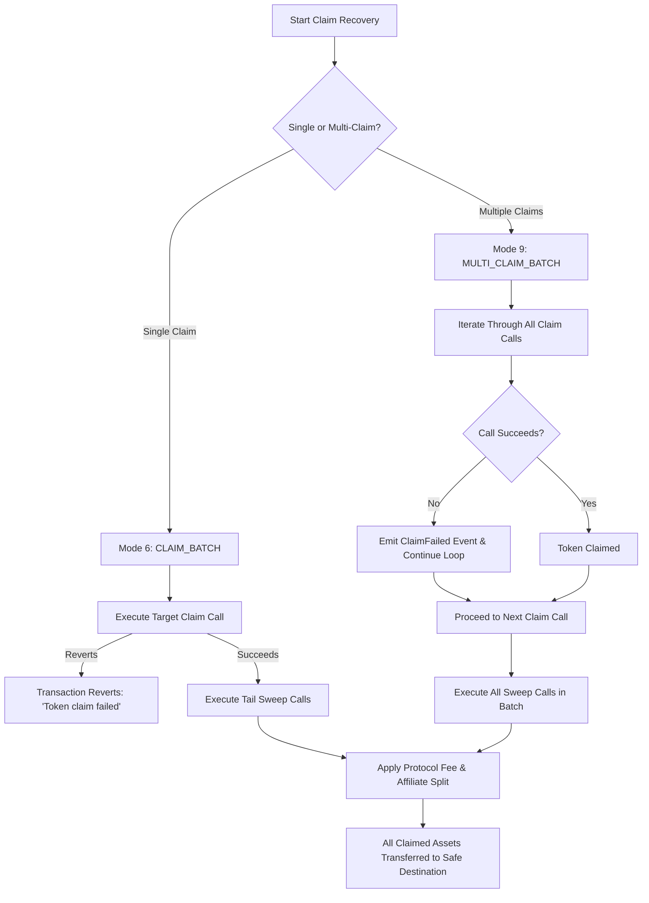

# Airdrop, Staking & Vesting Claims Guide (`/claim`)

> Atomically claim airdrops, unbonded staking yields, and token vesting tranches from compromised wallets and route them directly to safety.

Many protocols require a specific account to trigger a claim transaction before distributing tokens (e.g. Merkle airdrops, Uniswap LP reward distribution, synthetic asset claims, or vesting contracts). If an account is compromised, attempting to fund it with gas to claim these tokens results in the newly claimed assets or the deposited gas being immediately stolen by sweeper bots.

The **Claims & Airdrop Recovery** tool (accessible at `/claim`) executes the claim transaction and sweeps the proceeds to an uncompromised `safeDestination` within the exact same atomic transaction block.

---

## 1. Required Inputs & Field Specifications

| Field Name | Purpose | Expected Format | Required / Optional | Valid Example | Validation Constraints |
| :--- | :--- | :--- | :--- | :--- | :--- |
| **Compromised Wallet Address** | Account eligible for the airdrop or claim. | 42-character EVM hex address (`0x...`) | **Required** | `0x71C7656EC7ab88b098defB751B7401B5f6d8976F` | Validated via `isAddress`. Bytecode checked; cannot match safe destination or sponsor. |
| **Recovery / Safe Destination** | Uncompromised address receiving the claimed tokens. | 42-character EVM hex address (`0x...`) | **Required** | `0x9876543210987654321098765432109876543210` | Verified on-chain. Cannot be zero, burn address, token contract, or compromised account. |
| **Network Selection** | Chain hosting the distributor contract. | Dropdown | **Required** | Ethereum, Base, Optimism, BSC, Polygon, Monad | Target chain must be supported by RescueKit. |
| **Claim Contract Address** | The airdrop, distributor, or staking contract. | 42-character EVM hex address (`0x...`) | **Required** | `0x09CabEC1eAd18E18DC4524490B18Fa89e0B05213` | Must be a contract address with executable claim bytecode. |
| **Claim Calldata** | ABI-encoded call to trigger the distribution. | Hex string starting with `0x` | **Required** | `0x2e7ba6ef...` | Contains function selector and parameters (e.g. `claim(uint256,address,uint256,bytes32[])`). |
| **Tokens to Sweep** | ERC-20 contract addresses of tokens to extract after claim. | List of 42-character EVM hex addresses | **Required** | `[0x1f9840a85d5aF5bf1D1762F925BDADdC4201F984]` | The batch builder generates post-claim transfer calls for each listed token. |
| **Execution Mode** | Single-claim or resilient multi-claim. | Selection: `Single Claim` or `Multi-Claim` | **Required** | `Multi-Claim` (Mode 9) | Single-claim reverts on failure; Multi-claim executes leniency rules. |
| **Compromised Private Key** | Used strictly in client memory to sign batch authorization. | 64 hex characters (32 bytes) | **Required** (at execution time) | `0x0123456789abcdef...` | Never transmitted over the wire or saved to disk. |

---

## 2. Technical Mechanics & Execution Modes

RescueKit provides two dedicated execution modes for airdrop and claim recovery:



### Mode 6: Single-Claim Batch (`0x06`)
- **Mode Identifier**: `0x0100000000007821000600000000000000000000000000000000000000000000`
- **Digest Hashing**:
  ```solidity
  keccak256(abi.encode(mode, keccak256(abi.encode(calls)), referrer, block.chainid, address(this)))
  ```
- **Execution Flow**:
  1. `calls[0]` is the primary claim interaction (e.g. calling `merkleDistributor.claim(...)`).
  2. The contract executes `calls[0]`. If it fails, the entire transaction reverts with `"Token claim failed"`.
  3. Upon success, the executor executes `_tail(calls)`—the remaining calls in the array.
  4. These tail calls sweep the newly claimed ERC-20 tokens and any residual native gas directly to `safeDestination`.

### Mode 9: Multi-Claim Batch (`0x09`)
- **Mode Identifier**: `0x0100000000007821000900000000000000000000000000000000000000000000`
- **Lenient Execution Guarantee**: In many scenarios, a compromised wallet has multiple pending claims across different protocols or pools. If one claim reverts (e.g. because it was already claimed or the Merkle root expired), standard atomic batches would revert the entire bundle. Mode 9 solves this:
  - **Calldata Structure**: `abi.decode(executionData, (Call[] claimCalls, Call[] sweepCalls, bytes opData))`
  - **Digest Binding**:
    ```solidity
    keccak256(abi.encode(
        mode,
        keccak256(abi.encode(claimCalls)),
        keccak256(abi.encode(sweepCalls)),
        referrer,
        block.chainid,
        address(this)
    ))
    ```
  - **Execution Logic**:
    ```solidity
    for (uint256 i = 0; i < claimCalls.length; i++) {
        (bool ok, ) = claimCalls[i].target.call{value: claimCalls[i].value}(claimCalls[i].data);
        if (!ok) {
            bytes memory reason = _safeReturnData(256);
            emit ClaimFailed(claimCalls[i].target, i, reason);
        }
    }
    _executeCalls(sweepCalls, true, referrer);
    ```
  - Even if several claims fail, the executor catches the error, emits `ClaimFailed`, and proceeds to execute **all** sweep calls. Any successfully claimed tokens are rescued without being trapped by a single failing claim.

### Fee & Affiliate Processing
- As each token is swept from the compromised address, `_processERC20Sweep` checks the on-chain balance.
- If the token has a non-zero balance:
  - Protocol fee (15%) is deducted (`feeBps = 1500`).
  - If a valid referrer is eligible, 40% of that fee (6% of gross token value) is transferred directly to the affiliate address (`affiliateCutBps = 600`), and 9% routes to the protocol treasury.
  - If unreferred, self-referred, or during repeat rescues, 100% of the 15% fee routes to the protocol treasury.
  - The victim/`safeDestination` receives exactly **85.00%** net of all swept token value.

---

## 3. Step-by-Step User Flow

1. **Navigate to `/claim`**: Connect your local sponsor gas wallet and select the network.
2. **Scan for Known Airdrops**: RescueKit automatically scans popular distributors (e.g. Uniswap, 1inch, Optimism RetroPGF) for unclaimed balances associated with the compromised address.
3. **Configure Custom Claims**:
   - For custom contracts: Click **+ Add Custom Claim**.
   - Input the distributor contract address.
   - Paste the claim calldata (obtained from the project frontend or Merkle tree API).
   - Enter the token contract address that will be received.
4. **Set Recovery Destination**: Enter your clean, uncompromised wallet address.
5. **Verify Sponsor Gas**: Check that your sponsor wallet has enough native gas to cover the claim execution and subsequent transfers.
6. **Authorize Execution**:
   - Enter the compromised private key.
   - Click **Claim & Sweep**.
   - The client signs the EIP-7702 authorization tuple and the Mode 6 or Mode 9 digest.
   - The transaction is broadcast via private RPC failover pools.
   - Claimed tokens land directly in your safe wallet.

---

## 4. Error Scenarios & Troubleshooting

| Error Message | Root Cause | Internal Behavior | How to Resolve |
| :--- | :--- | :--- | :--- |
| `"Token claim failed"` | The claim call reverted in Mode 6 (e.g. already claimed, invalid proof, or claim expired). | Transaction reverts atomically; gas is refunded to sponsor minus execution cost. | Check claim status on block explorer. If managing multiple claims, switch to **Mode 9 (Multi-Claim)**. |
| `ClaimFailed(address target, uint256 index, bytes reason)` | A specific claim failed during Mode 9 execution. | Event emitted on-chain; execution continues to subsequent claims and sweep calls. | Check event logs on block explorer to review the specific revert reason from the failing contract. |
| `"Missing required 'claims' array."` | Request payload submitted without any claim interactions. | Pre-flight validation blocks request. | Provide at least one claim contract address and calldata payload. |
| `"Destination address cannot be the same as the compromised address."` | Safe destination matches compromised address. | Client validation blocks submission. | Enter an uncompromised recovery address. |
| `"Insufficient sponsor gas."` | Sponsor balance is lower than the gas required for multi-call execution. | Pre-flight gas check halts execution before broadcast. | Deposit native gas into the sponsor wallet. |
| `"Unauthorized"` (`0x82b42900`) | Recovered batch signer does not match compromised address, usually caused by signing `batchDigest` with raw ECDSA `sign` instead of EIP-191 `signMessage`. | Smart contract reverts with `Unauthorized()`. | Sign the digest using `account.signMessage({ message: { raw: batchDigest } })`. |
