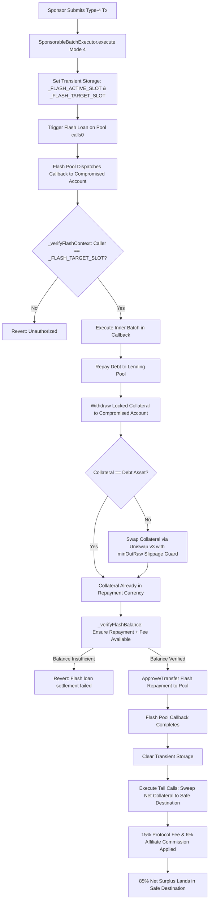

# DeFi Lending Collateral Rescue Guide (`/lending`)

> Atomically repay borrowed debt via flash loans, extract trapped collateral from lending markets, and sweep the net surplus directly to your safe wallet.

When a wallet holding active lending positions (e.g. on Aave v3, Morpho Blue, Balancer, or Moonwell) is compromised, victims cannot simply withdraw their collateral if debt is outstanding. The protocol requires repaying the borrowed assets first. If the victim deposits the debt assets into the hacked wallet, sweeper bots will drain them before the repayment and withdrawal can take place.

The **DeFi Lending Collateral Rescue** tool (accessible at `/lending`) solves this chicken-and-egg dilemma using **Mode 4 (`FLASH_LOAN_BATCH`)**:
1. It borrows the exact debt repayment capital via an uncollateralized **flash loan**.
2. It settles the outstanding debt and unlocks the supplied collateral.
3. It withdraws the collateral.
4. If the collateral is a different token than the debt asset, it routes a portion through a decentralized exchange (Uniswap v3) to acquire the repayment tokens.
5. It settles the flash loan and protocol premium.
6. It sweeps the entire remaining collateral surplus to `safeDestination` in the same atomic block.

---

## 1. Required Inputs & Field Specifications

| Field Name | Purpose | Expected Format | Required / Optional | Valid Example | Validation Constraints |
| :--- | :--- | :--- | :--- | :--- | :--- |
| **Compromised Wallet Address** | Account holding the collateral and debt positions. | 42-character EVM hex address (`0x...`) | **Required** | `0x71C7656EC7ab88b098defB751B7401B5f6d8976F` | Validated via `isAddress`. Cannot match recovery address or sponsor wallet. |
| **Recovery / Safe Destination** | Uncompromised wallet to receive extracted collateral. | 42-character EVM hex address (`0x...`) | **Required** | `0x9876543210987654321098765432109876543210` | Verified on-chain. Cannot be zero, burn, or token contract address. |
| **Lending Protocol** | Protocol where the position is open. | Selection: `Aave v3`, `Morpho Blue`, `Balancer`, `Moonwell`, `Custom` | **Required** | `Aave v3` | Built-in protocol adapters handle standard interfaces; `Custom` enables arbitrary calldata. |
| **Market / Pool Contract** | Address of the lending pool or vault contract. | 42-character EVM hex address (`0x...`) | **Required** | `0x87870Bca3F3fD6335C3F4ce8392D69350B4fA4E2` | Verified against known protocol registries or user-supplied address. |
| **Collateral Asset Address** | ERC-20 token locked as collateral. | 42-character EVM hex address (`0x...`) | **Required** | `0xC02aaA39b223FE8D0A0e5C4F27eAD9083C756Cc2` (WETH) | Must be a valid ERC-20 token with non-zero locked balance. |
| **Collateral Amount (`collateralRaw`)** | Quantity of collateral to withdraw. | Integer string in wei / base units | Optional (defaults to max `type(uint256).max`) | `1000000000000000000` (1 WETH) | Valid integer. Setting max extracts 100% of the collateral position. |
| **Debt Asset Address** | ERC-20 token that was borrowed. | 42-character EVM hex address (`0x...`) | Required if debt > 0 | `0xA0b86991c6218b36c1d19D4a2e9Eb0cE3606eB48` (USDC) | Must match the borrowed token required for repayment. |
| **Debt Amount (`debtRaw`)** | Outstanding debt balance to repay. | Integer string in wei / base units | Required if debt > 0 | `2500000000` (2,500 USDC) | Must be greater than 0 if a flash loan is needed to repay debt. |
| **Swap Configuration (`needsSwap`)** | Swap parameters if collateral differs from debt asset. | Object: `swapFrom`, `swapTo`, `sellAmountRaw`, `minOutRaw`, `feeTier` | Required only when collateral != debt (omit when collateral == debt) | `sellAmountRaw: 1.2 WETH`, `minOutRaw: 2550 USDC`, `feeTier: 500` | `minOutRaw` enforces strict slippage protection to guarantee flash loan repayment. Fee tier must be `100`, `500`, `3000`, or `10000`. When collateral equals debt, `needsSwap` is omitted entirely. |
| **Custom Function Signatures** | Human-readable Solidity signatures for unindexed protocols. | String: `function withdraw(...)` | Optional (for Custom mode) | `function withdraw(address asset, uint256 amount, address to)` | Parsed by `encodeCustomFunction`. Validates argument count and parameter types. |

---

## 2. Technical Mechanics & Execution Flow

RescueKit executes lending rescues via **Mode 4 (`FLASH_LOAN_BATCH`)**:



### Supported Flash Loan Providers & Callback Interfaces
`SponsorableBatchExecutor` natively implements callbacks for all major EVM flash loan standards:
1. **Aave v3**:
   - `executeOperation(address asset, uint256 amount, uint256 premium, address initiator, bytes params)`
   - Multi-asset batch: `executeOperation(address[] assets, uint256[] amounts, uint256[] premiums, address initiator, bytes params)`
2. **Morpho Blue**:
   - `onMorphoFlashLoan(uint256 assets, bytes data)`
3. **Balancer v2**:
   - `receiveFlashLoan(address[] tokens, uint256[] amounts, uint256[] feeAmounts, bytes userData)`
4. **Balancer v3**:
   - `onBalancerV3Unlock(address[] tokens, uint256[] amounts, bytes rescueCalls)`
5. **ERC-3156 Standard**:
   - `onFlashLoan(address initiator, address token, uint256 amount, uint256 fee, bytes data)`

### Anti-Spoofing & Callback Security
- **Strict Provider Locking**: Before requesting the flash loan, the executor binds the transaction context to the target lending pool.
- **Context Assertions**: When the provider triggers the contract's callback, the contract verifies:
  1. An authentic flash loan initiated by the victim's wallet is currently active.
  2. The caller executing the callback is strictly the authorized lending pool contract.
  3. The loan initiator matches the compromised account.
- If any condition fails, the execution immediately aborts with `Unauthorized()`, preventing external attackers or front-running bots from hijacking or spoofing callback functions.

### Liquidation & Slippage Safety
- When collateral must be sold to repay the flash loan, the batch includes an embedded Uniswap v3 swap.
- The user's input parameter `minOutRaw` defines the hard slippage floor:
  - If the market moves and the swap produces fewer tokens than `minOutRaw`, the Uniswap pool reverts.
  - If the flash loan balance check (`_verifyFlashBalance`) falls short of `amount + premium`, the contract reverts with `"Flash loan settlement failed"`.
  - The transaction aborts atomically without loss of collateral or funds.

### Multi-Position Atomic Lending Rescue
In scenarios where a compromised wallet holds multiple open positions (for example, borrowing USDC against collateral while also holding idle aTokens/deposits in another market), RescueKit can unwind all positions simultaneously:
- **Single Callback Batch**: All debt approvals, debt repayments, and collateral withdrawals are executed sequentially inside the single flash loan callback.
- **Mixed Asset Handling**: Handles same-asset collateral directly alongside cross-asset Uniswap v3 swaps in the same atomic block.
- **Multiple Sweeps**: After the flash loan settles, the executor sweeps each unlocked collateral token plus any residual debt dust directly to `safeDestination` in the tail calls.

---

## 3. Human-Readable Function Signatures for Custom Lending Markets

For unindexed protocols or custom forks, RescueKit allows users to specify custom function signatures and arguments directly:

```json
{
  "protocol": "custom",
  "contract": "0x1234567890123456789012345678901234567890",
  "collateralAddress": "0xC02aaA39b223FE8D0A0e5C4F27eAD9083C756Cc2",
  "withdrawFunction": "function withdraw(address asset, uint256 amount, address to)",
  "withdrawArgs": [
    "0xC02aaA39b223FE8D0A0e5C4F27eAD9083C756Cc2",
    "1000000000000000000",
    "0xCompromisedWalletAddress"
  ]
}
```

The batch compiler parses the function signature, validates parameter types (`uint`, `address`, `bool`, arrays), and encodes the calldata with zero risk of manual hex formatting mistakes.

---

## 4. Step-by-Step User Flow

1. **Navigate to `/lending`**: Select the blockchain network.
2. **Scan Position**: Enter the compromised wallet address. RescueKit queries the Aave/Morpho data providers to locate collateral deposits and borrowed debt balances.
3. **Configure Recovery**:
   - Verify detected collateral amount and debt amount.
   - If collateral differs from debt, review the automated Uniswap route and slippage tolerance.
4. **Enter Safe Destination**: Provide the uncompromised recovery address.
5. **Verify Sponsor Gas**: The sidebar calculates the gas needed for the flash loan, repayment, withdrawal, swap, and sweep calls. Ensure the sponsor wallet is funded with native gas.
6. **Authorize & Execute**:
   - Provide the compromised private key.
   - Click **Execute Flash Loan Rescue**.
   - The transaction borrows the debt asset, repays the loan, withdraws collateral, swaps the required repayment portion, satisfies the flash loan provider, and transfers the net collateral surplus to your safe wallet.

---

## 5. Error Scenarios & Troubleshooting

| Error Message | Root Cause | Internal Behavior | How to Resolve |
| :--- | :--- | :--- | :--- |
| `"Flash loan request failed"` | The initial flash loan call (`calls[0]`) reverted on the pool. | The lending pool rejected the loan (e.g. insufficient liquidity or unsupported asset). | Verify pool liquidity for the borrowed debt token; try borrowing a different asset or switching pools. |
| `"Flash loan settlement failed"` | Insufficient debt asset balance to repay the flash loan plus fee. | The post-operation balance check in `_verifyFlashBalance` was less than `amount + premium`. | Increase `sellAmountRaw` or adjust slippage tolerance `minOutRaw` to ensure enough debt tokens are acquired in the swap. |
| `"Position has debtRaw > 0 but is missing debtAddress."` | Input payload specified a debt amount without providing the debt token contract. | Pre-flight validation blocks request assembly. | Specify the valid ERC-20 contract address of the borrowed debt asset. |
| `"needsSwap.swapFrom and swapTo cannot be identical"` | Swap source and target addresses are identical. | Pre-flight validation rejects circular swap. | When collateral equals debt, omit `needsSwap` entirely; otherwise set `swapFrom` to collateral and `swapTo` to debt. |
| `"Invalid feeTier: must be 100, 500, 3000, or 10000."` | Uniswap v3 fee tier is not a recognized pool tier. | Input validation fails before encoding. | Select 100 (0.01%), 500 (0.05%), 3000 (0.3%), or 10000 (1%). |
| `"Unauthorized"` (`0x82b42900`) | Either caller to flash callback did not match expected pool (`_verifyFlashContext`), OR batch digest was signed with raw ECDSA `sign` instead of EIP-191 personal sign `signMessage`. | Contract reverts with `Unauthorized()`. | 1) Ensure pool address matches genuine lending deployment; 2) When client-signing `batchDigest`, use `account.signMessage({ message: { raw: batchDigest } })`. |
