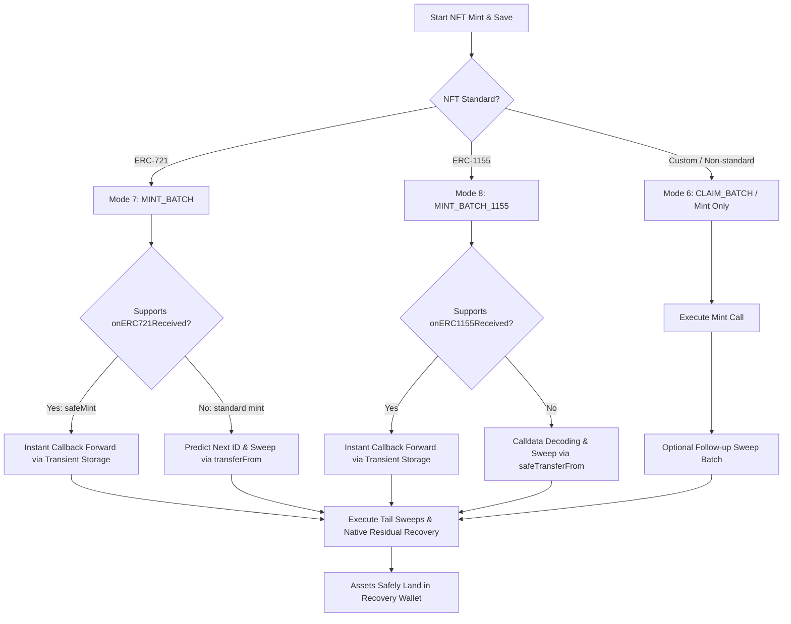

# NFT Mint & Save Guide (`/mint`)

> Atomically mint NFTs (ERC-721 and ERC-1155) from compromised allowlisted wallets and instantly sweep them to safe storage in a single transaction.

The **NFT Mint & Save** tool (accessible at `/mint`) allows victims whose compromised wallets hold exclusive mint allowlists, free claims, or public minting rights to execute the mint and immediately transfer the newly created NFT to a clean `safeDestination` without leaving the collectible vulnerable to mempool sweeper bots.

---

## 1. Required Inputs & Field Specifications

| Field Name | Purpose | Expected Format | Required / Optional | Valid Example | Validation Constraints |
| :--- | :--- | :--- | :--- | :--- | :--- |
| **Compromised Wallet Address** | Address holding the NFT mint allowlist or signature. | 42-character EVM hex address (`0x...`) | **Required** | `0x71C7656EC7ab88b098defB751B7401B5f6d8976F` | Checked via `isAddress`. Cannot be zero, precompile, or equal to the sponsor wallet. |
| **Recovery / Safe Destination** | Destination address where minted NFTs and residual funds will land. | 42-character EVM hex address (`0x...`) | **Required** | `0x9876543210987654321098765432109876543210` | Real-time validation: cannot match compromised address, cannot be a token contract, verified bytecode. |
| **NFT Contract Address** | The NFT collection contract to mint from. | 42-character EVM hex address (`0x...`) | **Required** | `0xBC4CA0EdA7647A8aB7C2061c2E118A18a936f13D` | Checked via ERC-165 for ERC-721 (`0x80ac58cd`) or ERC-1155 (`0xd9b67a26`). |
| **NFT Standard Mode** | Dictates batch assembly and sweep handling. | Selection: `ERC-721`, `ERC-1155`, or `Mint Only` | **Required** | `ERC-721` (Mode 7) or `ERC-1155` (Mode 8) | Mode 7 pins collection and sweeps predicted ID; Mode 8 sweeps edition ID; Mint-only executes arbitrary calldata. |
| **Mint Function Calldata** | Raw ABI-encoded calldata for the mint function. | Hex string starting with `0x` | **Required** | `0xa0712d680000000000000000000000000000000000000000000000000000000000000001` | Must contain valid 4-byte selector followed by encoded parameters (e.g. proof, quantity). |
| **Mint Fee (Native Value)** | Native ETH/gas required by the contract to pay for the mint. | Decimal number in ETH/native units | Optional (defaults to `0`) | `0.05` | Sponsor provides this value in the outer transaction payload; unused gas is automatically swept. |
| **Expected Token ID (1155)** | Target token ID for ERC-1155 edition mints. | Integer | Required for ERC-1155 if not in calldata | `1` | Parsed from calldata or supplied by user for verification. |
| **Compromised Private Key** | Used in client memory to sign EIP-7702 authorization and batch digest. | 64 hex characters (32 bytes) | **Required** (at execution time) | `0x0123456789abcdef...` | Held strictly in transient memory; never persisted or transmitted. |

---

## 2. Technical Mechanics & Execution Modes

RescueKit supports three distinct architectural pathways for NFT mint recovery:

### Mode 7: ERC-721 Mint & Save Batch
- **Dual-Path Atomic Sweep Protection**:
  1. **Instant Callback Forwarding**: If the NFT collection contract uses `safeMint`, it issues a callback (`onERC721Received`) to the recipient. RescueKit immediately catches this callback and transfers the NFT to `safeDestination` before the mint transaction even finishes.
  2. **Fallback Next-ID Prediction**: If the contract uses a standard `_mint` without callbacks, RescueKit queries the contract's current supply or next token ID before minting, and immediately invokes `transferFrom` to deliver the newly minted token ID directly to your recovery address.
  3. **Multi-Quantity Mints**: Supports minting and sweeping multiple consecutive token IDs (up to 100 NFTs) in a single atomic transaction.

### Mode 8: ERC-1155 Multi-Edition Mint Batch
- **Edition Sweep Execution**:
  1. If `safeMint` is invoked, the `onERC1155Received` or `onERC1155BatchReceived` hook instantly routes the minted edition(s) directly to `safeDestination`.
  2. For non-callback mints, the batch automatically inspects the newly minted token balance and executes `safeTransferFrom` to deliver the editions to your safe wallet.

### Mode 6: Custom Mint Only
- **Best For**: Non-standard mint mechanisms (such as Dutch auctions, multi-contract claim sequences, or customized minting vaults).
- Executes the custom mint call directly as a privileged atomic batch call.
- Follow-up sweeps can be bundled into the same transaction or executed as an immediate transfer batch.

### Residual Native Gas Sweep
When minting requires sending native ETH/gas to the NFT contract:
- The sponsor wallet forwards the mint fee as part of the outer transaction `msg.value`.
- Any residual ETH remaining in the compromised wallet after the mint completes is automatically collected by `_processNativeSweep`, split according to protocol fee rules (15% protocol fee: 6% gross to affiliate, 9% to treasury, or 15% to treasury if unreferred/repeat), and 85% net is transferred directly to `safeDestination`.

---

## 3. Step-by-Step User Flow

1. **Navigate to `/mint`**: Select the target network and enter the compromised wallet address.
2. **Enter NFT Collection & Calldata**:
   - Paste the verified NFT contract address.
   - Select the token standard (`ERC-721` or `ERC-1155`).
   - Paste the mint calldata (generated from Etherscan or project website allowlist signature).
   - Enter the required mint price in native ETH (e.g. `0.02 ETH`), or `0` for free mints.
3. **Set Safe Destination**: Enter your secure, uncompromised wallet address. Real-time validation verifies that the destination is not a contract and is ready to receive the NFT.
4. **Review Gas & Mint Valuation**: The sidebar displays the required sponsor balance: `mintPrice + estimatedGasFee`. Ensure the sponsor wallet is funded.
5. **Authorize & Execute**:
   - Paste the compromised wallet's private key.
   - Click **Execute Mint & Save**.
   - RescueKit signs the EIP-7702 authorization tuple and the Mode 7/8 batch digest locally in browser memory.
   - The sponsor wallet broadcasts the transaction to a private relay.
   - The mint executes and the token is transferred to `safeDestination` in the same block.

---

## 4. Error Scenarios & Troubleshooting

| Error Message | Root Cause | Internal Behavior | How to Resolve |
| :--- | :--- | :--- | :--- |
| `"NFT mint failed"` | The underlying NFT contract reverted during the mint call. | Execution in `SponsorableBatchExecutor` reverts with `"NFT mint failed"`. | Verify allowlist eligibility, merkle proofs, signatures, and ensure the mint has not concluded or sold out. |
| `"Invalid calldata: expected 0x-prefixed hex string"` | Calldata field was empty or not formatted as valid hex. | Client validation blocks submission. | Ensure the calldata begins with `0x` and contains valid hex characters. |
| `"Destination address cannot be the same as the compromised address."` | Entered the compromised address as the safe destination. | Pre-flight validation blocks execution. | Enter an uncompromised recovery address. |
| `"Sponsor wallet balance insufficient for mint fee and gas."` | Sponsor balance is less than `mintValue + gasFee`. | Pre-flight check halts execution before broadcast. | Deposit additional native ETH/gas into the local sponsor wallet address. |
| `"Token ID prediction failed for ERC-721 collection."` | Collection does not implement `nextTokenId()` or `totalSupply()`, and did not invoke `onERC721Received`. | Contract cannot determine the minted token ID to sweep. | Use **Mode 6 (Mint Only)** followed by a standard NFT transfer sweep. |
| `"Unauthorized"` (`0x82b42900`) | Recovered signer of the batch digest does not match the compromised wallet. Commonly happens if the client signs `batchDigest` using raw ECDSA `sign` instead of EIP-191 `signMessage`. | Smart contract reverts with custom error `Unauthorized()`. | 1) Ensure you are signing with the private key that owns the allowlist; 2) When client-signing, call `account.signMessage({ message: { raw: batchDigest } })`. |
