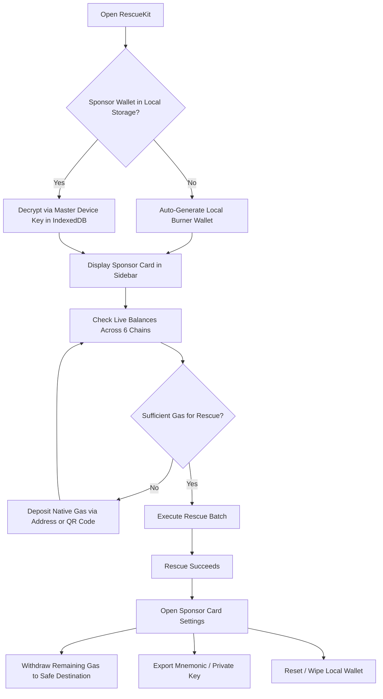

# Sponsor Gas Wallet & Affiliate Referral Guide (`/refer`)

> Complete guide to generating and managing the local sponsor gas wallet, funding execution gas, exporting/importing burner keys, and earning 6% on-chain referral commissions.

---

## 1. The Sponsor Gas Wallet

### Why a Sponsor Wallet is Required
When a wallet's private key is compromised, automated searcher scripts ("sweeper bots") monitor the address 24/7. Any native gas (ETH, BNB, POL) deposited into the compromised address is swept within milliseconds.

RescueKit circumvents this attack vector using **EIP-7702**:
- The compromised wallet authorizes execution by signing an ephemeral delegation tuple and an EIP-191 batch digest.
- An independent, uncompromised **Sponsor Gas Wallet** broadcasts the Type-4 transaction (`0x04`) and pays the network transaction fee.
- **Zero native gas is ever sent to the compromised wallet.** Sweeper bots cannot trigger because the compromised wallet never holds a positive gas balance.

### Client-Side Cryptography & Storage Architecture
The sponsor wallet is created and managed directly in your browser:
1. **Local Generation**: Created using `viem/accounts` (`generateMnemonic`, `mnemonicToAccount`). It generates a 12-word English BIP-39 mnemonic seed phrase and derives the primary private key and address.
2. **Device-Level AES-GCM 256-bit Encryption**:
   - A hardware/device master key is generated via the Web Crypto API (`crypto.subtle.generateKey({ name: "AES-GCM", length: 256 })`).
   - The device key is persisted locally in IndexedDB (`RescueKitCryptoDB` -> `device_keys` -> `master_device_key`).
   - The sponsor wallet credentials (address, private key, mnemonic) are encrypted with AES-GCM using a cryptographically secure random 12-byte initialization vector (IV).
3. **Local Persistence**: The resulting `EncryptedWalletBlob` (`{ salt, iv, ciphertext }`) is stored in `localStorage` under `wallet_rescue_sponsor_enc`.
4. **Zero Server Custody**: The server never receives or stores your sponsor private key. All operations occur in local client memory.

### Managing the Sponsor Wallet



#### Funding the Sponsor Wallet
- View the **Sponsor Gas Wallet** card in the dashboard sidebar.
- Click the **Copy Address** button or click **Show QR Code** to reveal a deposit QR code.
- Transfer a small amount of native gas from a clean exchange or secondary wallet (e.g. `0.005 ETH` on Ethereum/Base, `0.01 BNB` on BSC, or `0.5 POL` on Polygon).
- Click the **Refresh Balances** icon to update the multi-chain balance list in real time.

#### Exporting Credentials
- In the Sponsor Wallet card, click the settings menu (three dots) and select **Reveal Private Key / Seed Phrase**.
- Switch between the **Mnemonic (12 words)** and **Private Key (Hex)** tabs.
- Click **Copy** to save the backup in your password manager.

#### Importing an Existing Sponsor Key
- If you already have a funded gas burner or prefer using a specific key, open the settings menu and click **Import Custom Key**.
- Enter your 64-character hex private key. RescueKit derives the address, encrypts it with your device key, and replaces the active burner wallet.

#### Withdrawing Residual Gas
- After a rescue is completed, any leftover gas funds remaining in the burner wallet can be returned to your safe address.
- In the Sponsor Wallet card, click **Withdraw Balance**.
- Select the blockchain network, enter your safe destination address, and confirm. RescueKit transfers the entire balance minus the minimal network transfer fee.

#### Resetting the Wallet
- If you wish to wipe the local burner wallet completely, select **Reset Sponsor Wallet**.
- This clears the in-memory cache and calls `clearEncryptedWallet()`, removing `wallet_rescue_sponsor_enc` from `localStorage`. A fresh burner wallet is instantly created.

---

## 2. The Affiliate Referral Program (`/refer`)

RescueKit features a fully on-chain, trustless affiliate referral system that rewards users, whitehats, and security researchers who refer victims of wallet drains.

### Fee Structure & Commission Math
- **Protocol Fee**: Fixed at **15.00%** of all rescued asset value (`feeBps = 1500`, 1,500 / 10,000 basis points).
- **Affiliate Cut**: **40.00%** of the protocol fee (`affiliateCutBps = 600`, 600 / 10,000 of the total rescued amount).
- **Net Commission**: **6.00%** of the **gross asset value** recovered is paid directly to the referrer's address.
- **Protocol Treasury**: **9.00%** when referred; **15.00%** when unreferred, self-referred, or during repeat rescues.
- **Victim Net Recovery**: **85.00%** of gross asset value is delivered to `safeDestination`.

#### Example Calculation:
1. A compromised wallet rescues **10,000 USDC**.
2. Protocol fee (15%): `1,500 USDC`.
3. Affiliate commission (40% of fee): `600 USDC` (6.00% of gross total).
4. Protocol treasury (60% of fee): `900 USDC` (9.00% of gross total).
5. Victim receives: `8,500 USDC` (85.00% of gross total).

If unreferred or on a subsequent rescue by the same wallet:
- Protocol fee (15%): `1,500 USDC`.
- Affiliate commission: `0 USDC` (0.00%).
- Protocol treasury: `1,500 USDC` (15.00%).
- Victim receives: `8,500 USDC` (85.00%).

If the victim pays in native ETH/gas token, the split is calculated and paid natively within the exact same atomic transaction block.

### On-Chain Settlement Mechanics
Affiliate commissions are settled **atomically** inside the smart contract during the batch execution (`_payFeeNative` and `_payFeeERC20` in `SponsorableBatchExecutor.sol`):
- Commissions are **never held in custody** or accumulated in off-chain databases.
- The contract splits the fee and issues direct calls:
  - `_getFeeRecipient().call{value: treasuryAmount}("")`
  - `referrer.call{value: affiliateCut, gas: 50_000}("")`
- **First Fallback (Redirect to Treasury)**: If an affiliate address reverts or runs out of gas (e.g. an unoptimized contract receiver), the contract catches the error, emits `ReferralFailed(account, referrer, token, reason)`, and attempts to redirect the 6.00% affiliate cut to the protocol treasury to prevent the entire recovery batch from reverting.
- **Second Fallback (Direct Refund to Safe Destination — 91% Net)**: If redirecting the affiliate cut to the treasury *also* fails (e.g. treasury contract call reverts or rejects the token), the contract records `unpaidAffiliateCut = affiliateCut` and adds it directly to the user's sweep amount (`netSend += unpaidCut;` / `sendAmount += unpaidCut;`). Because EIP-7702 executes in the context of the victim's wallet (`address(this)` is the compromised address), there is no intermediate protocol vault. Refunding the unpayable 6% directly to `safeDestination` ensures the victim extracts **91.00%** net rather than leaving assets behind in the compromised address where sweeper bots could steal them. If the safe destination itself cannot receive the assets, the funds simply remain in the compromised account—underscoring why users must always supply a clean, verified recovery address (standard EOA or Safe multisig).

### Anti-Self-Referral & Exploitation Rules
To maintain the integrity of the protocol and prevent malicious actors from siphoning funds, `SponsorableBatchExecutor` enforces strict on-chain validation before executing any referral payment:

```solidity
bool canPayReferral = (
    referrer != address(0) &&
    referrer != address(this) &&
    referrer != _getFeeRecipient() &&
    referrer != msg.sender &&
    !referralPaid[address(this)] &&
    _getAffiliateCutBps() > 0
);
```

1. **Zero Address Block**: `referrer != address(0)` — referrals to the null address are discarded.
2. **Self-Referral Block (Compromised Address)**: `referrer != address(this)` — victims cannot refer their own compromised wallet to capture the affiliate cut.
3. **Sponsor Collision Block**: `referrer != msg.sender` — the sponsor gas wallet cannot be set as the affiliate referrer.
4. **Treasury Block**: `referrer != _getFeeRecipient()` — referrals to the protocol treasury are filtered.
5. **Destination Collision Block**: In `_payFeeNative` and `_payFeeERC20`, the contract verifies `target != referrer` and `to != referrer` — the recovery/safe destination cannot match the referrer.
6. **One-Time Referral Lock (Anti-Double-Dip)**: `!referralPaid[address(this)]` — after a compromised account completes its initial rescue transaction with an affiliate, `referralPaid[address(this)]` is marked `true`. Subsequent rescues from the same wallet do not pay duplicate referral bonuses; 100% of the 15% fee routes to the protocol treasury while the victim receives their full 85%.

### Generating Your Referral Link
1. Navigate to `/refer`.
2. In the **Payout Wallet Address** field, enter your clean EVM address or ENS name.
3. The page generates your unique link:
   ```text
   https://rescuekit.vercel.app/transfer?ref=0xYourWalletAddress
   ```
4. Click **Copy Link** or **Download QR Code** to share with users in need of asset recovery.
5. When a user visits RescueKit through your link:
   - The referrer address is stored in `localStorage` under `ref_wallet`.
   - The parameter `?ref=0x...` is automatically injected into all batch build requests (`/transfer`, `/mint`, `/claim`, `/lending`).
   - Commission is paid out directly on-chain when the victim executes their recovery.

---

## 3. Error Scenarios & Troubleshooting

| Error Message | Root Cause | Internal Behavior | How to Resolve |
| :--- | :--- | :--- | :--- |
| `"Insufficient sponsor gas. Please deposit at least X ETH..."` | The local sponsor wallet lacks sufficient native gas to pay for execution. | Pre-flight check disables the execution button. | Send native ETH/gas to the sponsor address shown in the sidebar. |
| `"Invalid private key: must be 32 hex bytes."` | Attempted to import a malformed private key. | Import modal input validation rejects the string. | Check that the private key contains exactly 64 hexadecimal characters. |
| `"Referral payout skipped: self-referral detected."` | Referrer address matched the compromised wallet or safe destination. | On-chain contract routes 100% of the protocol fee to the treasury; rescue completes normally. | Ensure the referrer address is an independent third-party wallet. |
| `ReferralFailed(address account, address referrer, address token, bytes reason)` | Referrer address is a smart contract that reverted during native gas or token transfer. | Event emitted on-chain; funds redirected to treasury to preserve victim's rescue. | Use a standard EOA (externally owned account) or Safe multisig as your referral payout address. |
| `"Master device key initialization failed."` | Browser IndexedDB is blocked or disabled in Private Browsing mode. | Encrypted wallet cannot be decrypted from storage. | Disable strict privacy isolation or generate a temporary burner wallet for the active session. |
