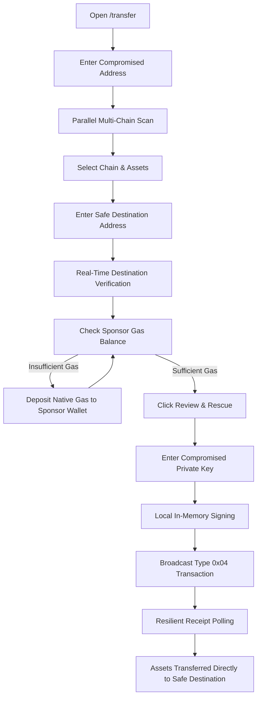

# Token & NFT Rescue Guide (`/transfer`)

> Step-by-step guide for rescuing trapped native assets, ERC-20 tokens, ERC-721 NFTs, and ERC-1155 multi-edition tokens from compromised EVM wallets.

The **Token & NFT Rescue** tool (accessible at `/transfer` or `/dashboard`) is RescueKit's primary recovery workflow. It allows victims to sweep all trapped tokens and collectibles in a single atomic transaction without sending gas to the compromised account.

---

## 1. Required Inputs & Field Specifications

| Field Name | Purpose | Expected Format | Required / Optional | Valid Example | Validation Constraints |
| :--- | :--- | :--- | :--- | :--- | :--- |
| **Compromised Wallet Address** | Identifies the compromised account to scan and recover assets from. | 42-character EVM hex address (`0x...`) | **Required** | `0x71C7656EC7ab88b098defB751B7401B5f6d8976F` | Validated via `validateCompromisedAddress`. Must be valid EVM hex; cannot be zero address, EVM precompile, or equal to the sponsor gas wallet. |
| **Recovery / Safe Destination** | The uncompromised wallet where rescued assets will be sent. | 42-character EVM hex address (`0x...`) | **Required** | `0x9876543210987654321098765432109876543210` | Validated via `preValidateDestination` and `verifyDestinationAddress`. Cannot be zero, dead/burn, precompile, the compromised wallet, or the sponsor wallet. Bytecode is checked on-chain. |
| **Network Selection** | The target blockchain where the trapped assets reside. | Dropdown selection | **Required** | Ethereum, Base, Optimism, BSC, Polygon, Monad | Supported chain in `CHAINS` registry. |
| **Asset Checklist (`tokens`)** | Tokens, native gas, and NFTs selected for recovery. | Array of token addresses or `"native"` | **Required** (at least 1 asset) | `["native", "0x833589fCD6eDb6E08f4c7C32D4f71b54bdA02913"]` | Must select at least one asset. For native ETH/MON, pass `"native"` inside `tokens` (do NOT use `includesNativeEth`). The executor sweeps excess native balance above the network reserve (e.g. 10.5 MON on Monad). |
| **Custom Token Address** | Contract address for tokens not automatically found by the scanner. | 42-character EVM hex address (`0x...`) | Optional | `0x833589fCD6eDb6E08f4c7C32D4f71b54bdA02913` | Checked via `detectTokenInfo`. Must be an ERC-20 contract. |
| **Custom NFT Address & IDs** | Collection address and token IDs for non-enumerable NFTs. | EVM address + integer token IDs | Optional | Address: `0xBC4C...`, IDs: `124, 559` | Validates address and parses token IDs as positive integers. |
| **Gas Speed Setting** | Gas priority for the sponsor transaction. | Enum: `normal`, `fast`, `rapid`, `custom` | Optional (defaults to `fast`) | `fast` | Adjusts `maxPriorityFeePerGas` to ensure rapid block inclusion. |
| **Compromised Private Key** | Used strictly in client memory to sign EIP-7702 authorization and batch digest. | 64 hex characters (with or without `0x`) | **Required** (at execution time) | `0x0123456789abcdef...` | Validated via `isValidPrivateKey`. Must be 32 bytes hex. Derived address must match compromised address. |

---

## 2. Validation & Security Checks

### Real-Time Destination Verification
Before allowing execution, RescueKit performs real-time synchronous and asynchronous validation on the recovery address:

1. **Synchronous Address Rules**:
   - **Empty / Malformed Check**: Rejects blank input or invalid EVM regex.
   - **Zero & Precompile Filter**: Rejects addresses from `0x0000000000000000000000000000000000000000` through `0x00000000000000000000000000000000000000ff` (EVM precompiles).
   - **Burn Address Filter**: Rejects known dead addresses (e.g. `0x...dead`, `0x...00000000`, `0x...beef`).
   - **Self-Destination Block**: Prevents setting the destination equal to the compromised address.
   - **Sponsor Collision Block**: Prevents setting the destination equal to the sponsor gas wallet.

2. **On-Chain Bytecode & Contract Verification**:
   - **EOA Detection**: If bytecode is `0x` (empty), identified as `VALID_EOA`.
   - **Safe Multisig Detection**: Calls `getOwners()` on the target. If successful, identified as `VALID_SAFE`.
   - **ERC-4337 Smart Account Detection**: Calls `entryPoint()` on the target. If successful, identified as `VALID_SMART_ACCOUNT`.
   - **EIP-7702 Account Detection**: Detects `0xef0100` prefix and compares the delegate address with the chain's batch executor.
   - **Token Contract Hard Block**: Queries ERC-165 and contract bytecode. If the destination is a known ERC-20 or ERC-721 contract, RescueKit **hard-blocks** execution with an error: *"Destination is a token contract. Trapped funds will be lost forever."*

---

## 3. Step-by-Step User Flow

1. **Navigate to `/transfer`**: The dashboard loads the configuration form and auto-generates or unlocks your local sponsor gas wallet.
2. **Enter Compromised Address**: Paste your compromised wallet address. RescueKit initiates parallel queries across all 6 supported chains using custom RPC failover pools.
3. **Select Network & Assets**:
   - Choose the chain containing the trapped assets.
   - Review detected balances (Native gas, ERC-20 tokens, ERC-721/1155 NFTs).
   - Check or uncheck assets as desired. Use the search bar to filter long asset lists.
4. **Add Custom Assets (If needed)**:
   - For unindexed tokens: Click **+ Add Custom Token**, paste the token contract address. RescueKit queries the contract for name, symbol, decimals, and live balance.
   - For non-enumerable NFTs: Click **+ Add Custom NFT**, enter the collection address and specific token IDs.
5. **Set Safe Destination**: Enter the address of your clean, uncompromised wallet. The UI badges the destination as EOA, Safe Multisig, or Smart Account.
6. **Fund Sponsor Gas Wallet**: Look at the Sponsor Wallet card in the sidebar. If the native balance for your selected chain is below estimated gas, transfer a small amount of native gas (e.g. 0.005 ETH/BNB/POL) to the sponsor address.
7. **Click "Review & Rescue"**: Opens the secure execution modal.
8. **Provide Compromised Private Key**: Paste the private key of the compromised account.
   > **Security Note**: Your private key is held exclusively in browser memory. It is never logged, stored in `localStorage`, or sent over HTTP.
9. **Authorize & Execute**:
   - Step 1 (`validate`): Verifies live token balances, gas thresholds, and addresses.
   - Step 2 (`assemble`): Constructs ERC-7821 batch calls and computes execution digests.
   - Step 3 (`submit`): Signs the EIP-7702 authorization tuple and EIP-191 batch digest in browser memory, bundles them into a Type-4 transaction signed by the sponsor wallet, and broadcasts to a private MEV relay or public RPC.
   - Step 4 (`confirm`): Monitors block confirmations via resilient polling and links directly to the block explorer upon completion.
   - **Fee Settlement**: Protocol fee of 15% (`feeBps = 1500`) is automatically deducted on-chain during transfer. If an affiliate referred the user, 6% of gross value goes to the affiliate and 9% to the treasury (or 15% to treasury if unreferred/repeat). Exactly **85.00%** net arrives in `safeDestination`.

---

## 4. Error Scenarios & Troubleshooting

| Error Message | Root Cause | Internal Behavior | How to Resolve |
| :--- | :--- | :--- | :--- |
| `"Please enter a safe recovery address."` | Safe destination input field was left blank. | Form submission button is disabled; validation status marked as `INVALID`. | Enter a valid 42-character EVM recovery address. |
| `"Safe destination cannot be the compromised address."` | Entered the compromised address as the destination. | Pre-validation rejects input; destination badge displays red blocked state. | Enter a separate, clean wallet address. |
| `"Destination is a token contract. Trapped funds will be lost forever."` | Entered an ERC-20 or ERC-721 contract as the destination. | On-chain bytecode inspection identifies token contract interface. | Provide a personal EOA or multisig address. |
| `"Insufficient sponsor gas. Please deposit at least X ETH..."` | Sponsor burner wallet lacks sufficient native gas to cover estimated transaction gas. | Pre-flight gas check compares sponsor balance against `estimatedGas * maxFeePerGas`. | Copy the sponsor wallet address and send native gas (e.g. 0.005 ETH) from a clean exchange or wallet. |
| `"Invalid tokens list: tokens array is required and must not be empty"` | Request omitted `tokens` or supplied an empty list. | Pre-flight request validation rejects payload. | Provide at least one token contract address or `"native"` in the `tokens` array. |
| `"Invalid private key: must be 32 hex bytes."` | Provided string is not 64 hex characters or contains invalid characters. | Regex format validation fails before attempting address derivation. | Verify private key string; ensure it is 64 hex characters (0-9, a-f). |
| `"Private key does not match compromised address."` | Derived address from private key does not equal the compromised address entered in Step 1. | `privateKeyToAccount(key).address.toLowerCase() !== compromisedAddress.toLowerCase()`. | Ensure you are pasting the private key belonging to the compromised wallet. |
| `"No balance found to rescue for the selected assets."` | Selected tokens or native currency have 0 balance on-chain. | Batch assembler detects 0 executable calls. | Verify selected chain and ensure assets have not already been drained. |
| `"Unauthorized"` (`0x82b42900`) | Recovered batch digest signer does not match the compromised account. Commonly occurs if the client signs `batchDigest` using raw ECDSA `account.sign` instead of EIP-191 personal sign `account.signMessage`. | Smart contract execution reverts with `Unauthorized()`. | Use `account.signMessage({ message: { raw: batchDigest } })` to sign the digest with Ethereum prefix. |
| `"Transaction confirmation timed out after 60000ms."` | RPC network congestion delayed block confirmation. | `waitForReceiptResilient` polled for timeout duration without receiving receipt. | Check the transaction hash on the block explorer. The transaction may still confirm shortly. |
